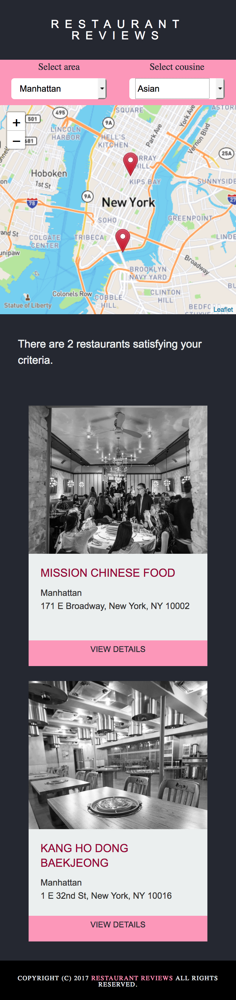
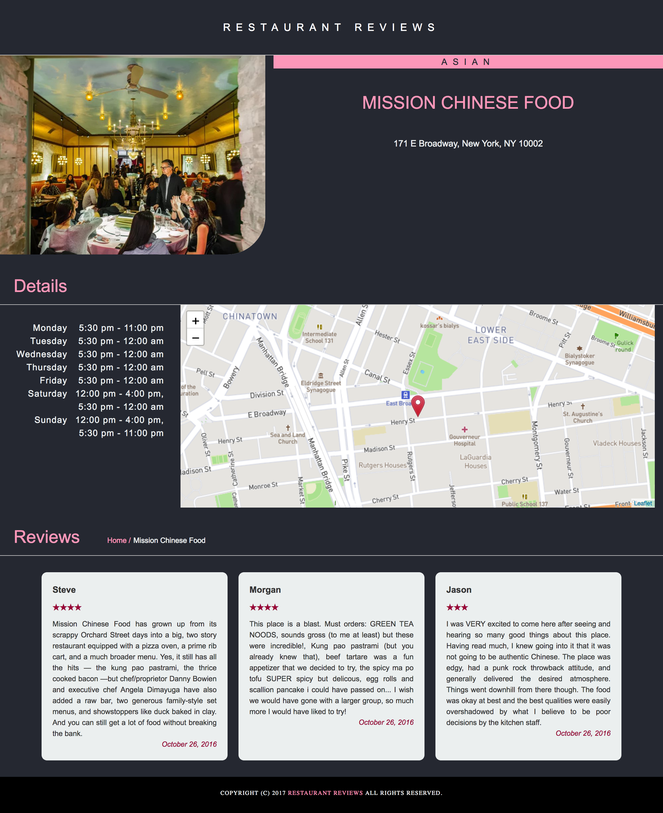
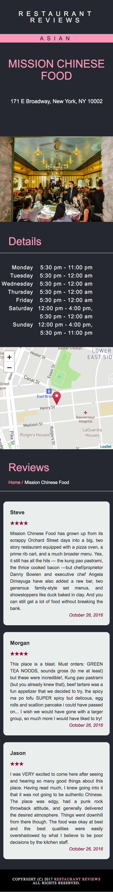

# Restaurant Review - project for UDACITY FrontEnd Web Developer Nanodegree Course
---

### Specification
The task consisted of:
 - fixing all issues,
 - fixing layout for web and mobile devices,
 - applying accessibility features and
 - applying service workers
 in code provided for the  **Restaurant Reviews** website.

### How to run project

[live demo](https://ewelinaki.github.io/Restaurant-Review-UDACITY-project/)

1. Install python3.6. To check version write `python -V` in your terminal.
2. Run the server with command `python3 -m http.server 8000`.
3. Open the site: `http://localhost:8000`in your browser.

## Leaflet.js and Mapbox:

This repository uses [leafletjs](https://leafletjs.com/) with [Mapbox](https://www.mapbox.com/).

## Screenshots

index.thml view wide screen

index.thml view mobile screen

restaurant.thml view wide screen

restaurant.thml view mobile screen

